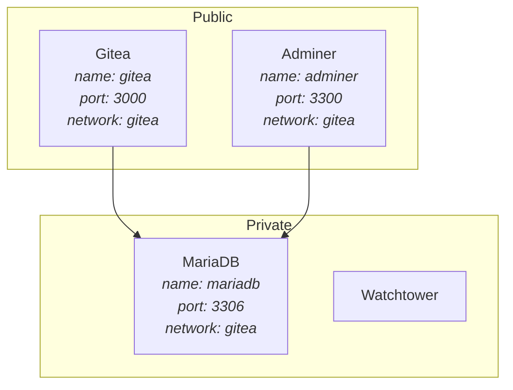

# Wesley

| OS           | IP            | Hardware  |
|--------------|---------------|-----------|
| Ubuntu 23.10 | 192.168.1.159 | Zimablade |

## Networks

- default
- gitea

## Services

### Adminer

A spiritual successor of phpmyadmin. I use this to manage the Mariadb instance running on Wesley.

### Gitea

Used to back up all the git repositories I have. This includes my personal github and anything else
I work with.

#### Gitea Mirrors

A cron job is running daily from `/home/meza/homelab/gitea-mirror-github.sh` which checks for new repositories
on my GitHub account and mirrors them to my gitea instance.

The config file for it can be found at `/home/meza/homelab/gitea/mirrorer/config.json`.

### MariaDB

Used by Gitea and Adminer. Might be used by other services in the future.
The root password is in lastpass, named: `wesley-mariadb-root`.

### Watchtower

Automatically updates all the docker containers running on Wesley.
